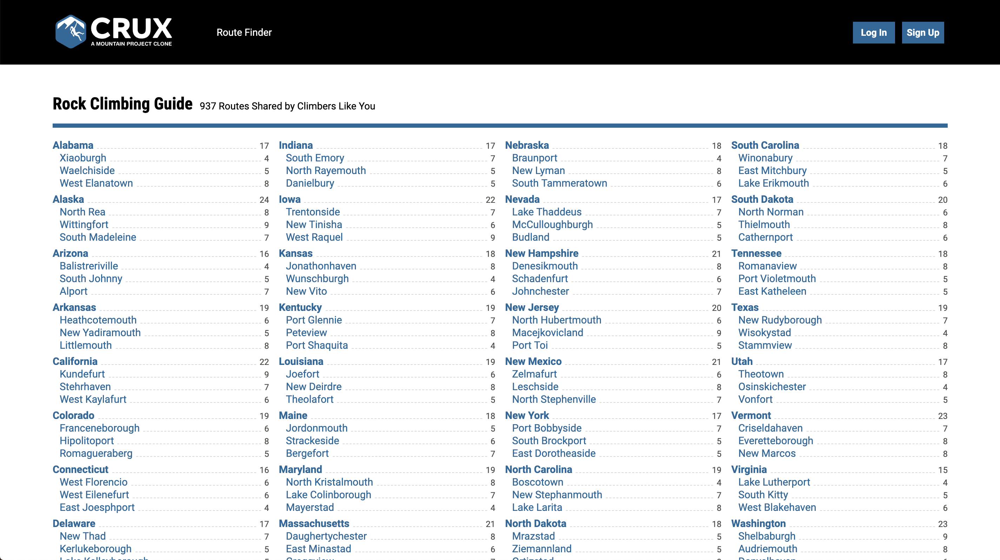
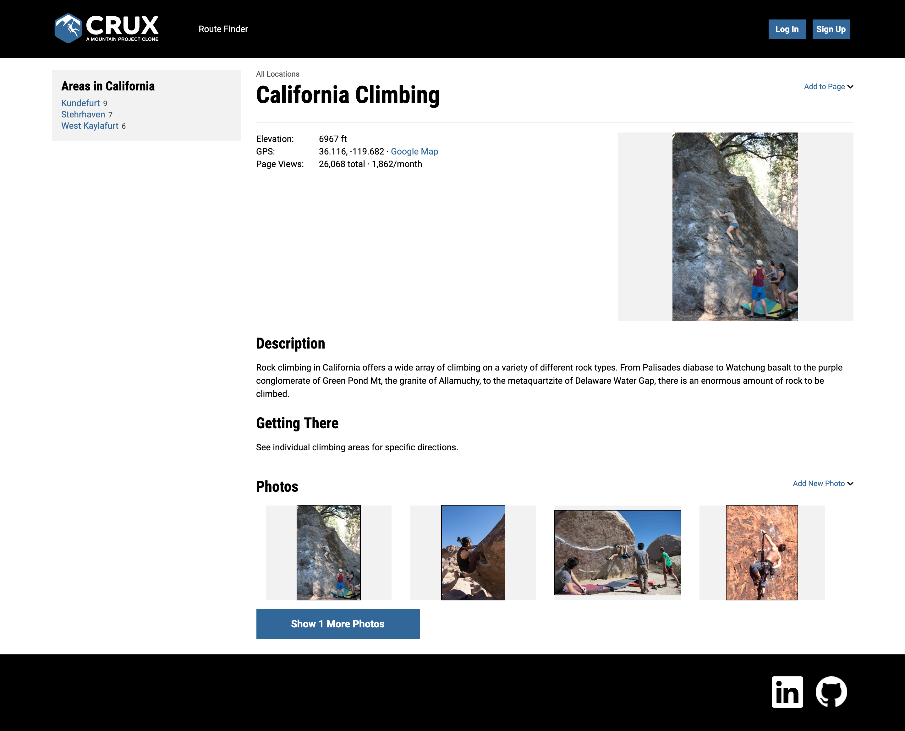
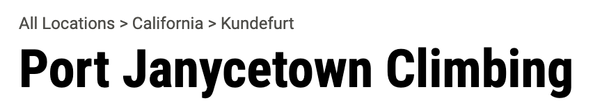
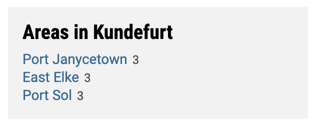
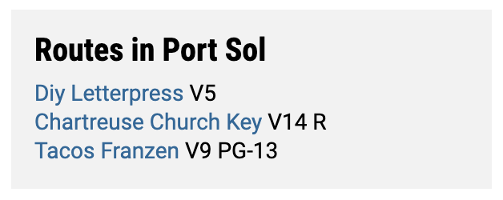
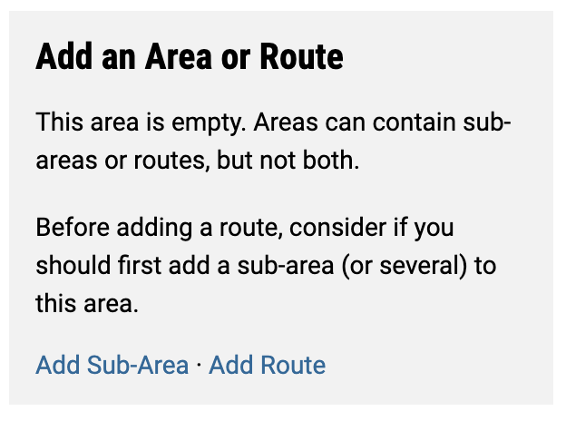
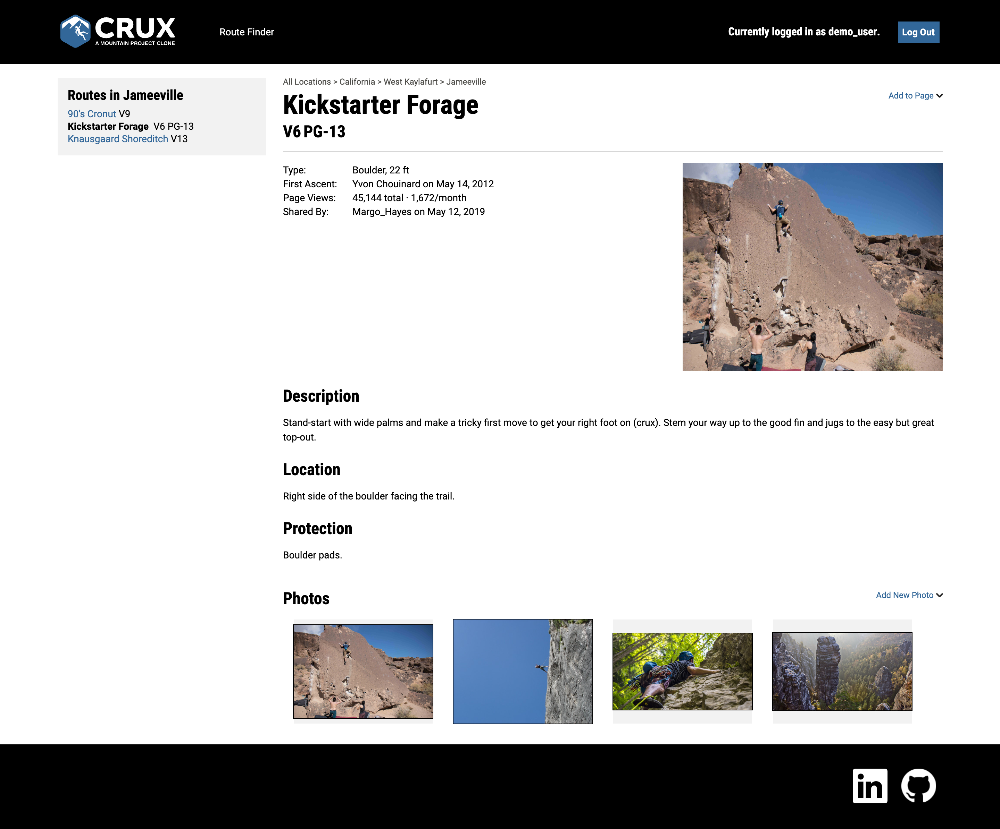

# Crux

[Live Demo](https://crux-fsp.herokuapp.com/#/)

Crux, a Mountain Project clone, is a web app that allows users to find rock climbing routes, photos, and guides throughout the world. It makes use of a Rails/PostgreSQL backend with React.js and Redux on the frontend.

The project was designed and built within a two-week timeframe, though I plan to continue adding improvements over time.

## Technologies

### Back end

* Ruby 2.5.1
* Rails 5.2.3
* PostgreSQL

### Front end

* React
* Redux
* Javascript/ES6

### Other tools

* AWS for image storage and uploading
* Webpack

## Features

### Homepage

Users are immediately taken to a list of climbing areas sorted by state. In the top navigation, users can navigate to the Route Finder, log in, or sign up. Each area in the list has the number of routes contained within them. A count of the total number of routes on the website is tracked next to the list header. These counts update themselves when a new route is created.



### User Auth and Protected Routes

Frontend to backend user authentication is secured using BCrypt. The log in and sign up forms are implemented with a modal for a smooth transition.


Only logged in users can create areas and routes. When a user tries to create an area or route and they are not logged in, they will be promted with the login modal. Users who attempt view `/add/climb-area/areaId` or `/add/climb-route/areaId` directly while logged out will be redirected to the show page of the area they are attempting to add to.


Only the author of the area or route can edit it. The link to edit the page will only appear if the user is logged in and is the author. Users who attempt view `/area/areaId/edit` or `/route/routeId/edit` directly while logged out and/or who is not the author will be redirected to the show page of the area or route they are attempting to add to.


### Areas

Area show pages contain the area data, a description of the climbing area, instructions on how to get to the area, photos of the area, and a sidebar of the subareas or routes contained within the area.

When logged in, users can create new subareas and edit subareas they posted.



Above the area title, there are links to the ancestors of the area. This was achieved using a recursive method which was then added to the area's slice of state using JBuilder.



```ruby
def areaPath(parent_id)
  return [] if parent_id == nil 
  area = Area.find(parent_id)
  return areaPath(area.parent_id).concat([area])
end
```

Area show page sidebars will change based on if the area contains subareas, routes, or neither.



Subareas in the sidebar contain links to the area and lists the number of routes it contains.



Routes in the sidebar contain links to the route and lists their grade and safety rating if less than "G".



Areas that do not contain subareas or routes contain links to add one or the other.

### Routes

Route show pages share many of the same features as area show pages. Route show pages contain the route data, a description of the route, a description of the route location, photos of the route, and a sidebar of the neigboring routes.

When logged in, users can create new routes and edit routes they posted.



### Photos

Users can upload photos while creating areas or routes and directly on the area and route show pages.


Photos appear on the show page and will truncate after 4 photos. A button will appear when there are more than four photos and when clicked will reveal the hidden images.


### Route Finder

Route finder is a search feature that will narrow down climbing routes based on the contraints you give it.


## Possible Future Features

In the future I would like to add:
* Area and route comments [In Progress]
* More robust route finder
* Allow users to add routes to a tick list (to-do list)
* Allow users to tick of routes (mark as complete)
* Allow users to rate routes
* User dashboard
* Photo information and comments
* Forum